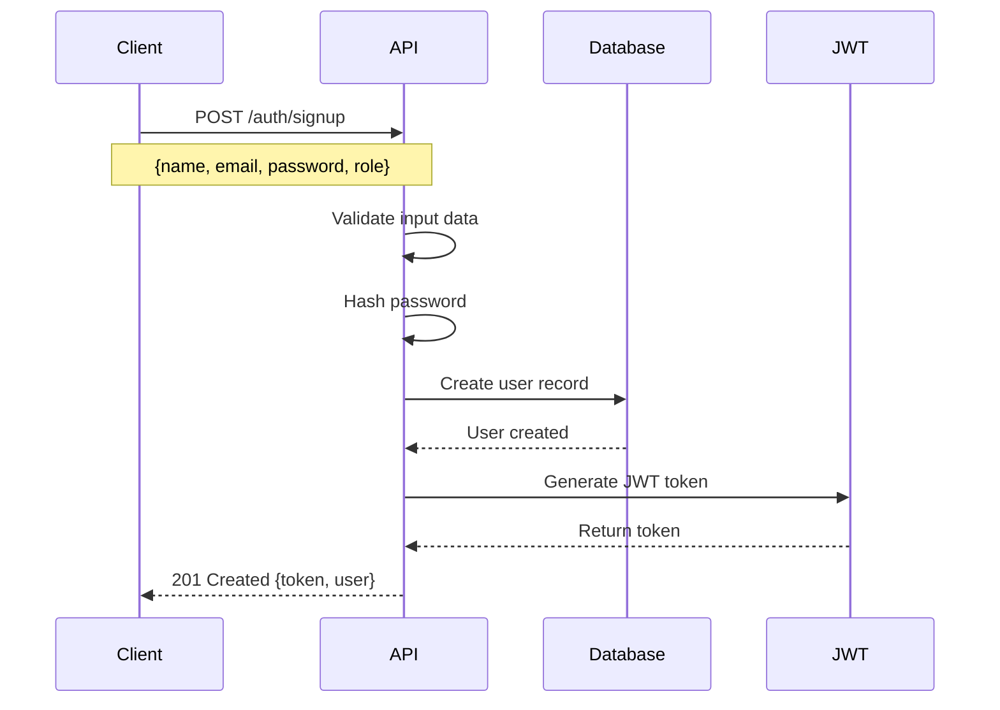
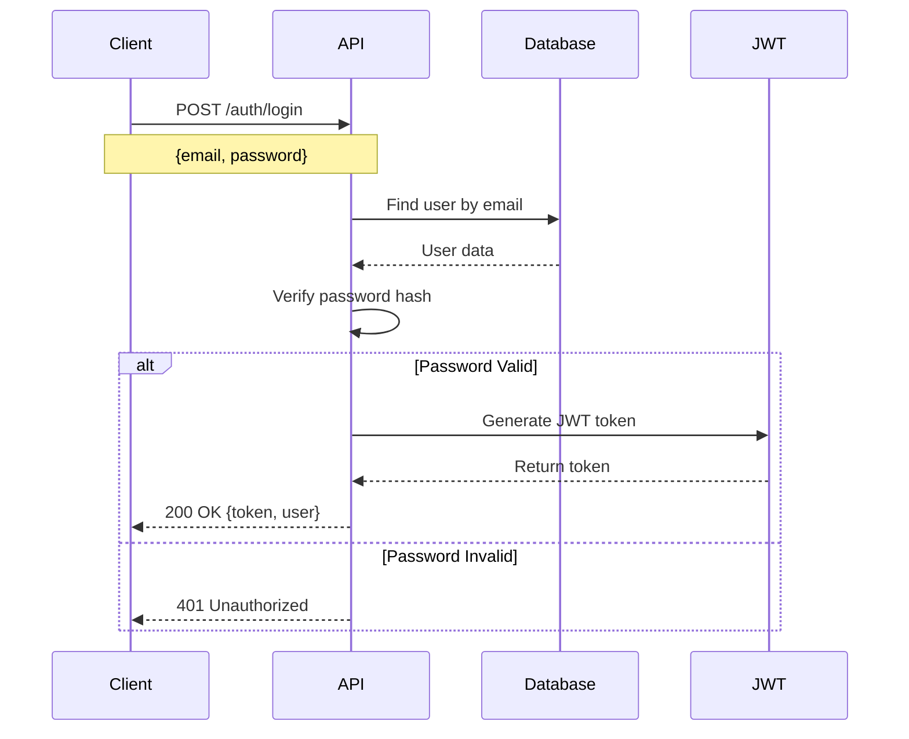
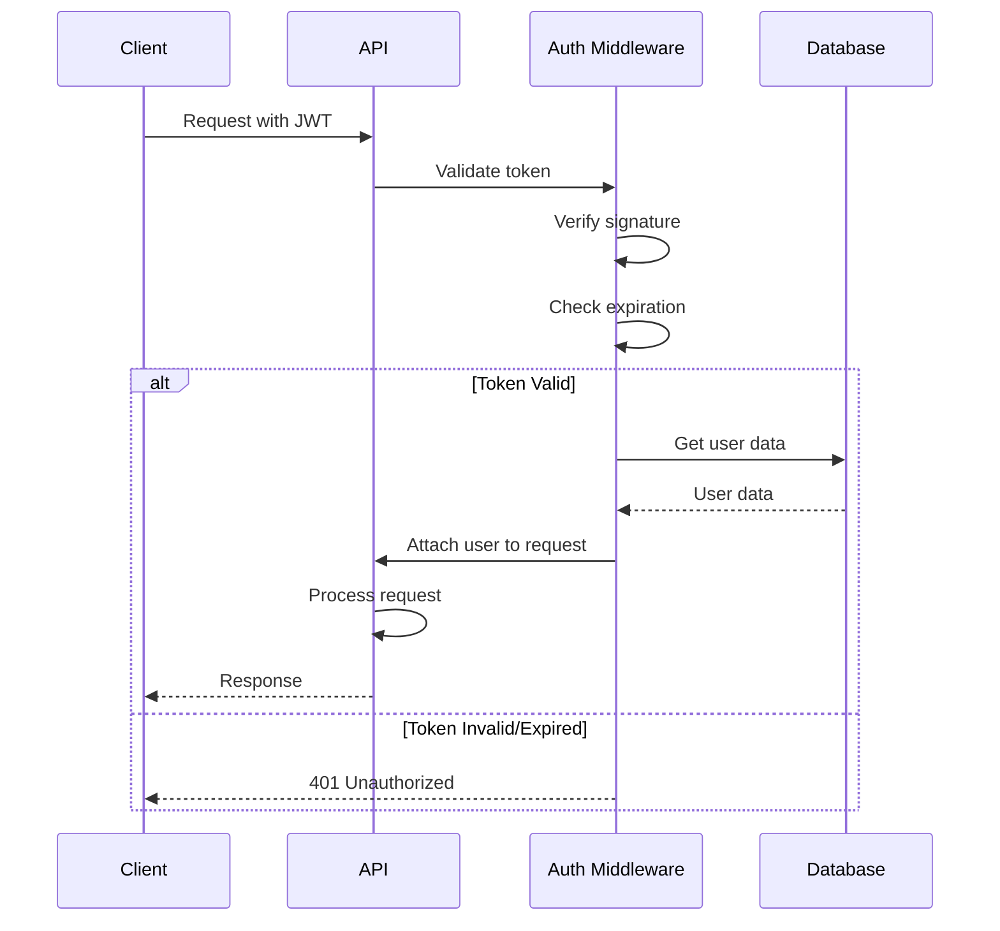
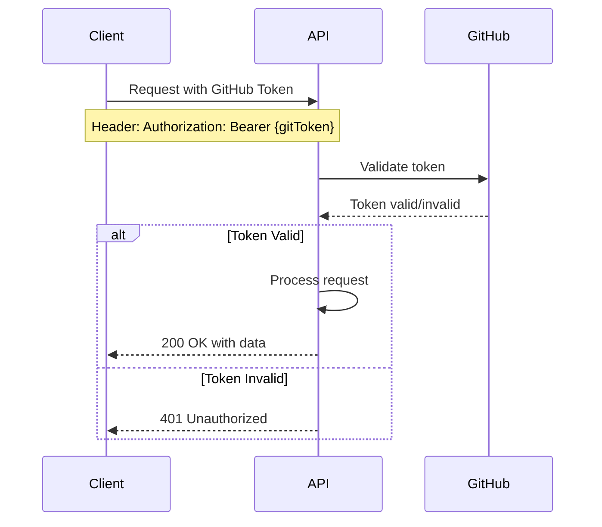
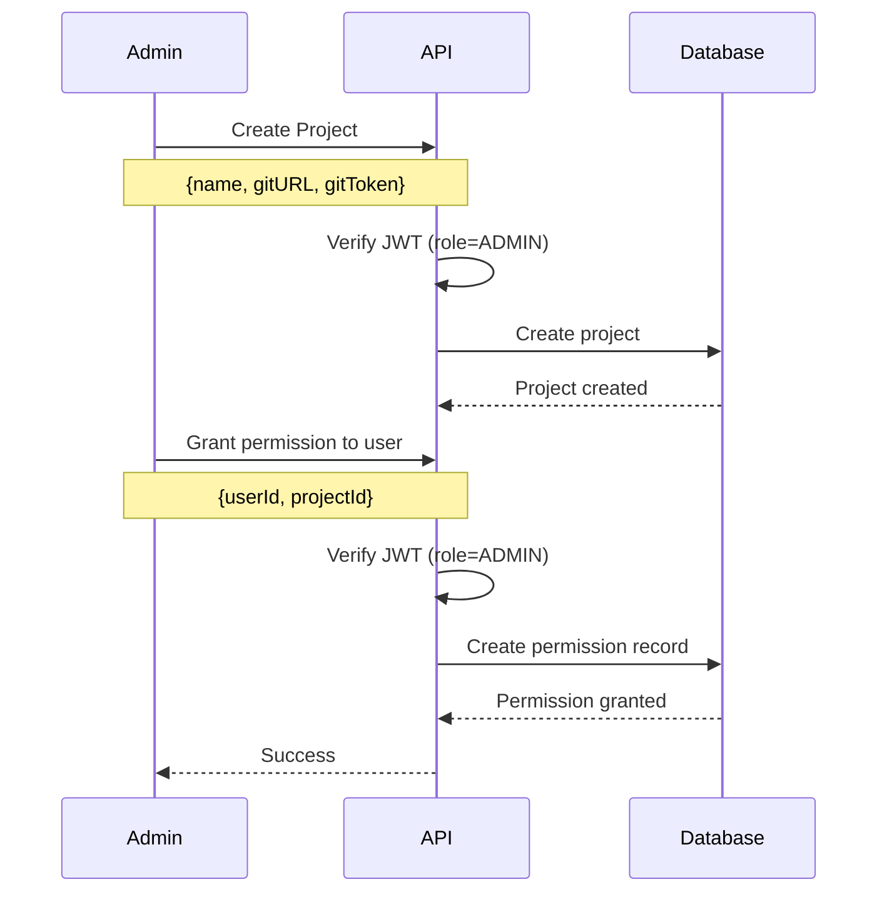
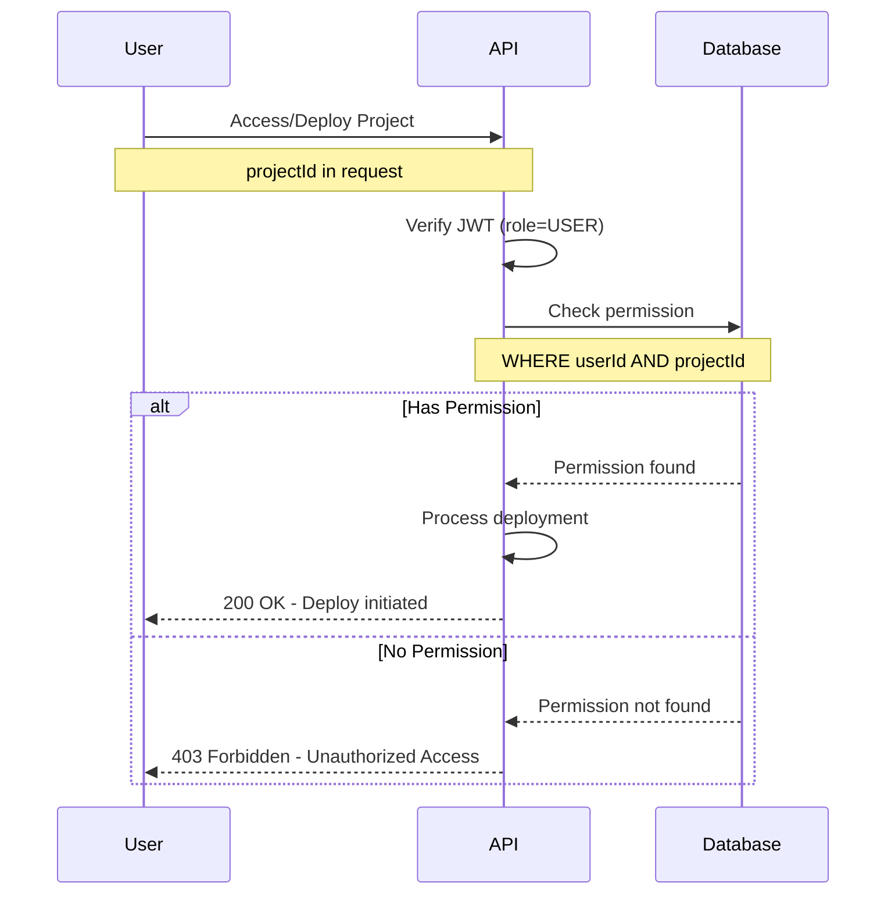

# Authentication and Authorization

## Overview
This document describes the authentication and authorization mechanisms implemented in the project. The system uses JWT-based authentication with role-based access control (RBAC) to secure endpoints and features.

---

## Authentication

### Authentication Methods

The system supports two authentication methods:

1. **Email/Password Authentication**
2. **GitHub Token Authentication**

### Signup Process

#### User Registration
Users can register with the following information:

- **Name**: Full name of the user
- **Email**: Valid email address (unique)
- **Password**: Secure password (hashed before storage)
- **Role**: User role (`ADMIN` or `USER`)

#### Signup Flow

### Login Process

#### User Login
Users authenticate using:

- **Email**: Registered email address
- **Password**: User password

#### Login Flow

---

### Complete Authentication Flow

---

### GitHub Token Authentication

Users can authenticate using GitHub personal access tokens for project creation and management.

#### GitHub Auth Flow

---

## Authorization

### Role-Based Access Control (RBAC)

The system implements role-based access control with two primary roles:

1. **ADMIN**: Full access to all features
2. **USER**: Limited access based on permissions

### Admin Flow

#### Admin Capabilities

After signup with role `ADMIN`, administrators can:

1. **Create Projects**
     
        Project name
    
        Git URL
    
        Git token

2. **Deploy Projects**
     
        Single button deployment
     
        Full deployment control

3. **Grant Permissions**
     
        View list of all users
     
        Grant/revoke access to specific users
     
        Manage user permissions per project

#### Admin Authorization Flow

### User Flow

#### User Capabilities

After signup with role `USER`, regular users have:

1. **Limited Access**
 
   Can only access projects they're granted permission to
 
   Cannot create new projects
 
   Cannot grant permissions to others

2. **Permission-Based Actions**
 
   **With Permission**: Can deploy assigned projects
 
   **Without Permission**: Receive unauthorized access error

#### User Authorization Flow

---

